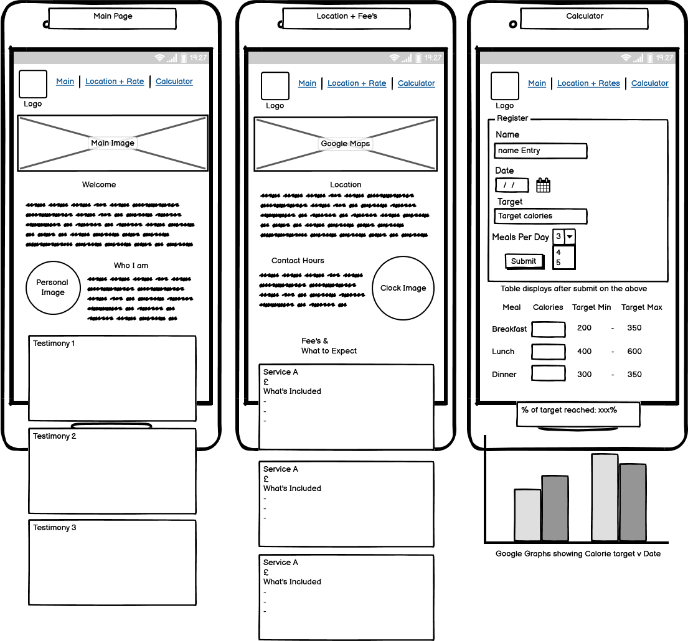
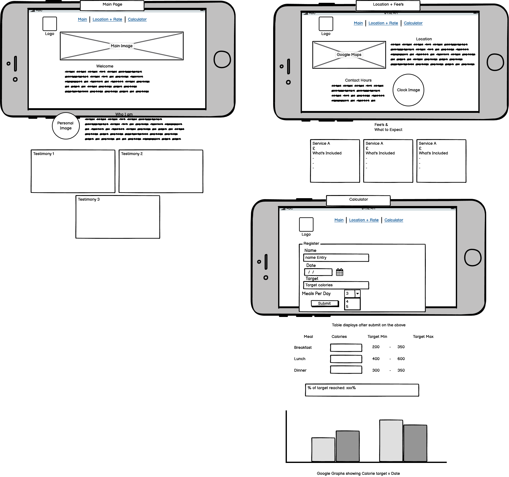
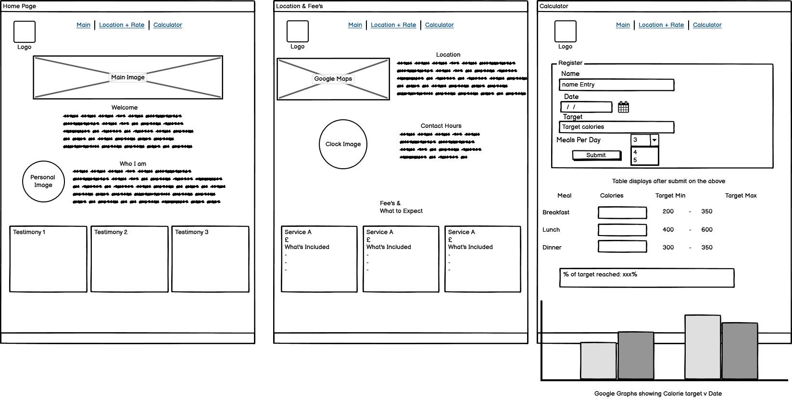
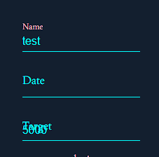

# Exert Fitness Website and Second Project

**Index**
- [Introduction](#Introduction)
- [Research](#Research)
- [Approach](#Approach)
- [Design](#Designing-of-the-Website)
    - [Strucutre](#structure-of-the-site)
    - [Colors](#color-scheme)
    - [Fonts](#font-selection)
    - [View - Mobile](#mobile-design)
    - [View - Tablet](#tablet-design)
    - [View - Laptop](#laptop-plus-design)
- [Expected Uses of Website](#expected-uses-of-website)
- [Focus of project](#focus-of-the-project)
- [Progression of Website](#progression-of-website)
    - [Start](#start)
    - [Mid-project](#mid-project)
    - [Final stage](#final-stage)
    - [Future developments](#future-developments)
- [Test & Bugs](#test--bugs)
- [Acknowledgements](#acknowledgements)
- [References](#references)
********************
## <u>Introduction</u>
This website is created for my friend Egle Ratkeviciute, who is expanding and advertising services of personal training for people within Coventry City, United Kingdom. To offer a unique service for Egle's clientell and utilize my requirement of Project 2 for my Level 5 diploma through Code Instistute. The websites requirements will need to display a friendly/approachable service with listings of capabilities and benefits offered to the user.

As a service tool, the website will include a feature to track and plan their calories intake. Offering a unqiue benefit over local competition.

## <u>Research</u>
1. characteristics of personal trainers
    * Routine
        1. For personal trainers to optimize their clients muscle growth, a schedule is created with the client for type of excersizes, daily routine and removal of bad-habits.
            1. This feature can be met with an "objectives" chart or progression feedback at a later stage of the website application. 
    * Consumption
        1. A huge impactor to personal training and gaining muscle is the balance of consumption. A Healthy maintenance of weight and muscles requires Women to consume approximately 2,000 calories per day and Men to consume 2,500 calories per day. 
        Egle's approach is to adjust the calorie requirement to customers on an independent basis. i.e a new starter who needs to add mass to convert to muscle will be given a target of 3,000 calories, or an existing client needing to gain muscle but already started on the base 3,500 will be increased to 4,000.
        2. Browsing over websites, several guides have included the reason for calories, how to count calories or even types of food, i.e protein.
        website [www.omnicalculator.com/health/meal-calorie#how-many-calories-per-meal-should-i-eat](https://www.omnicalculator.com/health/meal-calorie#how-many-calories-per-meal-should-i-eat)
            note as I was previously researching this website was displayed as an information/blog post. since this has been created as a calculator too. My coding has not been influenced from this website.
    * Excersize
2. Identification of uses
3. Information/Methods required

## <u>Approach</u>

## <u>Designing of the Website</u>
   ### Structure of the site
   I've chosen the site to have a clear and easy to use navigation hosted over 3 seperate pages. 
   <strong>Page 1</strong>
   This page is the main introduction to the companies website. Overall image should be friendly, informative and proving why the potential client should progress further. 
   <strong>Page 2</strong>
   Allowing the user to view the services provided more in-depth with prcing details and locations or accessibility. Informtion should still be simple and easy to use, making decisive (locational) information available at the start. 
   <strong>Page 3</strong>
   Final page is a resource used during training/logging, allowing users to check their calorie intakes. With this feature on the main website free for all to use, the information provided may help gain clientell (as their information will be tracked on a spreadsheet) whilst providing a guide to the user of estimated calories for the dedicated meals.

   ### Color Scheme
   1. Exert Fitness had previously created a logo, presenting a color-scheme for the company and how it is displayed. This was originally Dark Blue and Red, but since changed with consultation with designing artist. This since changed to the current light blue for the male models and light pink on the female models, overall making more approachable for both/all genders.
    1. Testing the font of pink against the dark blue background of the logo (color #131f2f), color contrast and accesibility has provided a good level.
   ### Font Selection
   Browsing wesbites availalbe,  I found Googles examples of serif family - providing a clear and strong fonts with an elegant finish. 
   ### Mobile Design
   For mobile phones, the width of screens are limited with widths and selection area. To counter this, the wireframe created follows a simple flow with exception of two fields where the image is related to the information adjacent and less volume. 
   

   ### Tablet Design
   Similar to the above Mobile Design, Tablets offer a wider screen view but with it's cursor selection requiring space as these are mostly navigated by fingertips. The additional space offers more room to expand on font sizes, division blocks and the images. 
   

   ### Laptop Plus Design
   Laptops or desktop offer the clearest visual displays and accurate selection with mouse pointers. This factor has been counted in when drawing the wireframe for the final display stage, allowing images to be adjacent to the text but spread across the page, information boxes to be wider and displayed inline for easier comparison. 
   
   

## <u>Expected Uses of Website</u>

## <u>Focus of the Project</u>
*********************
## <u>Progression of Website</u>
### Start
The skeleton of the created website was drafted and agreed with Egle (company owner), which also listed required paragraphs with required content. Egle reached out to her friend who created the blogs and bio's.

To ensure it's contents is relatable, a comparison of personal trainers websites for layouts, featured text and page contents were generated. Whilst researching layouts and content, a note was also made regarding target clientell and what they feature. 
To create a unique selling point of the website/service provided, I found an algorithm which breaks down target calories to % of the total. Maximizing calories intakes for good health and well being (eating 50% of your target calories during the final meal of the day equal to doubling the target calories as your body stores the excess fats/energy).

On startup of the business, Egle had a logo created which included a shield with a male and female figure. The male figure was in a light blue whilst the female side was in a dark red. Reviewing at a later stage, this was edited (by Egle) as the red was too bright/aggressive for a color scheme but wanted something more friendly, resulting in the light blue and pink color scheme. 
This allowed me to feature the logo's colors as the website schemes. 

#### Mid-project
First two pages include HTML and CSS information with minimal content to avoid over-whelming the user on their first visit to the website. Text including blogs and testimonies were trimmed back to avoid the "wall of text", including for smaller devices.

The main focus of my project has three stages to be completed.
1. Entry of name, date, calories and division of meals.
2. Calories consumed per meal and broken down with target values.
3. Results of totals calories consumed then displayed on a line graph chart (alternatively pie chart showing total % of meals with total calories consumed at the bottom.)

First two sections have now been created, 
Initial entry of name , date, target and meals are only visible on first load of the screen : 
<image src="assets/images/readme_files/startup_fields.png" alt="first load of window with limited entry fields" height="450px">  
Without a value being entered into "Target" field, an error is generated on loading of Exert Fitness web page as no value is in the variable "tCal" also proceeding to next stage displays Not A Number (NaN). As this will be a required field in future update but also enter a default value of 2,000 (reccomended daily allowance for females).

#### Final stage
#### Future developments
 1. Objective and target board to be included as part of an app/login feature. (research 1, Routine)
 2. Scheduled e-mails to owner of Exert Fitness to advise of users who have updated their calorie counts on the website.

## <u>Test & Bugs</u>
### Fixed
 1. Inner HTML removing instantly after applying function.
    * Within the function, an HTML script was drafted to input on the page. As this was not pushed or appended to a variable listed above the information was removed causing the display to temporarily showing the expected result then dissapearing
 4. Nav bar not extended to full width on calculator page.
    * Fix - this was caused by CSS Styling as the display was fit-content rather than fixing to screen width.
 5. Values showing as object then string, despite logging parseInt.
    * Fix - Although input fields have been entered as number fields, the logging of .value stored into JS as an object. 
    Whilst I was unable to correct this within minimal set of coding, I logged the input field as the variable, later passing the code with parseInt and .value attached - forcing the correct number Integer to be found.
 6. Input Labels are designed to move up on selection, when entered with a value the label will remain above the entry. But for "Target" entry, the label hides behind the input text causing an overlap. 
     
    * Fix - this was found to be caused as the label was not associated with the input. Using the For tag with a matching ID links both fields together preventing the text to move back over/under the input value.
### Current Bugs
 2. If table allowed 3 and 4 to be displayed with different answers, but 5 was not showing
 3. Imported tables not showing headers
 7. Google Graphs not displaying - advised variable of google.visualization not defined
*********************

### Technologies used:
    For this site, I am using the languages of HTML, CSS and JavaScript.
    I've also selected to use google spreadsheets to store and fetch data (Via API) which will be presented in google graphs

## <u>Acknowledgements</u>
- Pexel Images
    * Tima Miroshnichenk, "small404" image - https://www.pexels.com/photo/a-person-holding-a-smartphone-on-a-pink-background-7009834/
- w3 Schools
    * Responsive Navigation Bar, to display navigation with smaller screens in a compact format - https://www.w3schools.com/howto/howto_js_topnav_responsive.asp
    * Pie Chart settings to display values entered by the user - https://www.w3schools.com/ai/ai_chartjs.asp
- Scheme Color
    * Color scheme for pie charts on the calculator page - https://schemecolor.com
## <u>References</u>
- Jason Reynolds (Brother) - for the support and guidance whilst asking questions on how to find the answer and being my rubber duck.