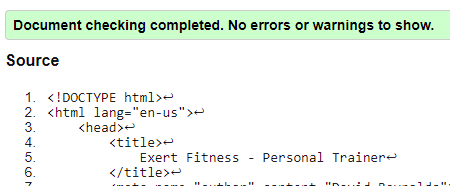

# Exert Fitness Website and Second Project

**Index**
- [Introduction](#Introduction)
- [Research](#Research)
- [Approach](#Approach)
- [Design](#Designing-of-the-Website)
    - [Structure](#structure-of-the-site)
    - [Colors](#color-scheme)
    - [Fonts](#font-selection)
    - [View - Mobile](#mobile-design)
    - [View - Tablet](#tablet-design)
    - [View - Laptop](#laptop-plus-design)
- [Expected Uses of Website](#expected-uses-of-website)
- [Focus of project](#focus-of-the-project)
- [Progression of Website](#progression-of-website)
    - [Start](#start)
    - [Mid-project](#mid-project)
    - [Final stage](#final-stage)
    - [Future developments](#future-developments)
- [Test & Bugs](#test--bugs)
- [Acknowledgements](#acknowledgements)
- [References](#references)
********************
## <u>Introduction</u>
This website is created for my friend Egle Ratkeviciute, who is expanding and advertising services of personal training for people within Coventry City, United Kingdom. To offer a unique service for Egle's clientele and utilize my requirement of Project 2 for my Level 5 diploma through Code Institute. The websites requirements will need to display a friendly/approachable service with listings of capabilities and benefits offered to the user.

As a service tool, the website will include a feature to track and plan their calories intake. Offering a unique benefit over local competition.

## <u>Research</u>
1. characteristics of personal trainers
    * Routine
        1. For personal trainers to optimize their clients muscle growth, a schedule is created with the client for type of excercises, daily routine and removal of bad-habits.
            1. This feature can be met with an "objectives" chart or progression feedback at a later stage of the website application. 
    * Consumption
        1. A huge impactor to personal training and gaining muscle is the balance of consumption. A Healthy maintenance of weight and muscles requires Women to consume approximately 2,000 calories per day and Men to consume 2,500 calories per day. 
        Egle's approach is to adjust the calorie requirement to customers on an independent basis. i.e a new starter who needs to add mass to convert to muscle will be given a target of 3,000 calories, or an existing client needing to gain muscle but already started on the base 3,500 will be increased to 4,000.
        2. Browsing over websites, several guides have included the reason for calories, how to count calories or even types of food, i.e protein.
        website [www.omnicalculator.com/health/meal-calorie#how-many-calories-per-meal-should-i-eat](https://www.omnicalculator.com/health/meal-calorie#how-many-calories-per-meal-should-i-eat)
            note as I was previously researching this website was displayed as an information/blog post. since this has been created as a calculator too. My coding has not been influenced from this website.
    * Exercise
2. Identification of uses
    * Whilst comparing the information required for the website to be operational and expected features
    * A share of personal trainers prefer to focus on the nutritional balance (Carbohydrates, Proteins, Fats, Vitamins, Minerals, Dietary Fibre and Water), but the logging of this would not be something (or least I can imagine/aware of). 
    * Tracking of calories specified for a users target: The behaviour of logging calories consumed allowed JavaScript code to manipulate data, behave on actions/entries from the user and process efficiently. This resulted in the best method/focus of approach with endless oppertunity to improve/amend behaviours at a later date.
3. Information/Methods required
    * To ensure the information processed is correct, I used local gym, health wellbeing and nutrition websites to gather information on trends and targets. 

## <u>Approach</u>

### Designing of the Website
   ### Structure of the site
   I've chosen the site to have a clear and easy to use navigation hosted over 3 separate pages. 
   <strong>Page 1</strong>
   This page is the main introduction to the companies website. Overall image should be friendly, informative and proving why the potential client should progress further. 
   <strong>Page 2</strong>
   Allowing the user to view the services provided more in-depth with pricing details and locations or accessibility. Information should still be simple and easy to use, making decisive (locational) information available at the start. 
   <strong>Page 3</strong>
   Final page is a resource used during training/logging, allowing users to check their calorie intakes. With this feature on the main website free for all to use, the information provided may help gain clientele (as their information will be tracked on a spreadsheet) whilst providing a guide to the user of estimated calories for the dedicated meals.

   ### Color Scheme
   1. Exert Fitness had previously created a logo, presenting a color-scheme for the company and how it is displayed. This was originally Dark Blue and Red, but since changed with consultation with designing artist. This since changed to the current light blue for the male models and light pink on the female models, overall making more approachable for both/all genders.
    1. Testing the font of pink against the dark blue background of the logo (color #131f2f), color contrast and accessibility has provided a good level.
   ### Font Selection
   Browsing wesbite's available,  I found Googles examples of serif family - providing a clear and strong fonts with an elegant finish. 
   ### Mobile Design
   For mobile phones, the width of screens are limited with widths and selection area. To counter this, the wireframe created follows a simple flow with exception of two fields where the image is related to the information adjacent and less volume. 
   

   ### Tablet Design
   Similar to the above Mobile Design, Tablets offer a wider screen view but with it's cursor selection requiring space as these are mostly navigated by fingertips. The additional space offers more room to expand on font sizes, division blocks and the images. 
   

   ### Laptop Plus Design
   Laptops or desktop offer the clearest visual displays and accurate selection with mouse pointers. This factor has been counted in when drawing the wireframe for the final display stage, allowing images to be adjacent to the text but spread across the page, information boxes to be wider and displayed inline for easier comparison. 
   
    
    Note - during progression of the website, some layouts have varied from the expected with improved or re-purposed designs.
    Mobile design was to display a list of testimonies from the clients, which displayed as a long list or only selection of examples - this was edited to present as a tile cycling through depending on the users selections. 
    This amendment was then reflected to ther view modes. 

## <u>Expected Uses of Website</u>

Expected users of the website are for seekers of gaining personal fitness and personal trainer. To Introduce the potential client to the peronal trainer the first page is an introduction to the advertiser of the website, followed by experiences of users of the service. 
This page is intentionally kept as an easy flowing, simplistic layout for the consumer to navigate easily. 
Second page is for further interest, showcasing the location, timetables and expected fee's. Also similar to the landing page with a simplistic view with levels of information presented in an ordered fashion to advise the client what what to expect and fee's of services. 
Third page is the primary focus of the project and feature offered for re-occuring users of the website. This page is used for the entry and review / calculation of targets and tracking. With this page, data entry and manipulation will be the aim of the form entries. The buttons and labels (for input fields and the table header) will guide the user on what sections to complete and where.
### Features for User Experience   
To support the user navigation and use of my website, I have opted to update specific area's the customer will be using for more information:

Updating of charts:
As the button will need to display a command which either progresses to the next stage, or display a chart - having an icon display "next" or "display chart" is no longer relevant after the information has been displayed. To counter this, the inner text has been edited within the mentioned buttons for a confirmation the action a re-click will product:
 
| Button     | Before       | After      |
|-------|-------|-------|
|Entry chart || |
|Display Chart |  | |

## <u>Focus of the Project</u>

### The JavaScript Journey
Learning with JavaScript has been tough from the begining, but finding more use of dev tools and console log there was an gradual level of understanding and it's application. The website features three main sections coded or reliant on JavaScript to function as intended.

1. Nav Bar
When a specific max-width is trigged for display of the webiste, JavaScript reduce the navigation bar from three hyper links (seperate pages) to the current page and hamburger menu. Clicking on the hamburger menu acts as a dropdown, which uses JavaScripts onclick function. 
 
Implementing this JavaScript Function was more copied with minor edits from W3 Schools website - mentioned in the [Acknowledgements](#Acknowledgements) section below.

2. Testimony Tile  
Rather than displaying a list of testimonies posted by users/clients, I re-drawn the idea testimonies can be placed on Tiles that can be rotated (almost carousel like). 
To achieve this, each testimony were created with a set class (testimony-tile). This class will have a default CSS Style hiding the documents (display:none)
Javascript is used in this block to declare a variable of element with a Class Name specifying a numerical target. The numerical target within the variable is another variable determining which "tile" is selected.  
 
At the bottom of the tile, two buttons adjust the numeric value inserted to the variable for tile selection. For this, each each offered a function of on click then add or subtract 1, updating the numeric value outside the function. 
This variable is then called with .style function of JavaScript to edit it's display fuction to Block, navigating through the Parent divisions children.

3. Calculator entry and analtyics  
Each inputs for this section has included a unique ID, allowing JavaScript to select and declare variables with each numeric value to their relative inputs. The aim for this section is to retrieve values entered by the user to display targets and performance statistics.
After entering values into the first batch of entry fields, the user is to select the "Next" icon, to run a function.  
This function retreives the mentioned values storing variables, then performes an if statement dependent on the users entry from the dropdown input. 
Inner text is updated from the "next" button as this will be updating their selection from the original opted. 
The table presented is inserted by the table selecting a division then writing .innerHTML. 
Calculations are taken from the users input of Target calories per day then broken down to a specific % following the recommended guideline taken from website mentioned in the below acknowledgements. 
Third section of calculator entry is after selecting display chart, the button is then updated to show "Update Chart", for improved user experience. 
This then draws a pie chart below using guidance from W3 Schools and Google Graphs. The header shows a total count cumulation of carlories taken too. 

 
note - after updating the above and saving, the table was reset entering different details. Resulting in discrepancies from picture A to picture B.
 
Above images also include Buttons which change context upon clicking. Mentioned above table under user experiences displays a use of function calling a inner Text replacement - operated by JavaScript's capabilities.

*********************
## <u>Progression of Website</u>
### Start
The skeleton of the created website was drafted and agreed with Egle (company owner), which also listed required paragraphs with required content. Egle reached out to her friend who created the blogs and bio's.

To ensure it's contents is relatable, a comparison of personal trainers websites for layouts, featured text and page contents were generated. Whilst researching layouts and content, a note was also made regarding target clientele and what they feature. 
To create a unique selling point of the website/service provided, I found an algorithm which breaks down target calories to % of the total. Maximizing calories intakes for good health and well being (eating 50% of your target calories during the final meal of the day equal to doubling the target calories as your body stores the excess fats/energy).

On start-up of the business, Egle had a logo created which included a shield with a male and female figure. The male figure was in a light blue whilst the female side was in a dark red. Reviewing at a later stage, this was edited (by Egle) as the red was too bright/aggressive for a color scheme but wanted something more friendly, resulting in the light blue and pink color scheme. 
This allowed me to feature the logo's colors as the website schemes. 

#### Mid-project
First two pages include HTML and CSS information with minimal content to avoid over-whelming the user on their first visit to the website. Text including blogs and testimonies were trimmed back to avoid the "wall of text", including for smaller devices.

The main focus of my project has three stages to be completed.
1. Entry of name, date, calories and division of meals.
2. Calories consumed per meal and broken down with target values.
3. Results of totals calories consumed then displayed on a line graph chart (alternatively pie chart showing total % of meals with total calories consumed at the bottom.)

First two sections have now been created, 
Initial entry of name , date, target and meals are only visible on first load of the screen : 
<image src="assets/images/readme_files/startup_fields.png" alt="first load of window with limited entry fields" height="450px">  
Without a value being entered into "Target" field, an error is generated on loading of Exert Fitness web page as no value is in the variable "tCal" also proceeding to next stage displays Not A Number (NaN). As this will be a required field in future update but also enter a default value of 2,000 (recommended daily allowance for females).

Edit (Mobile Design) 
To Improve customers user experience, prevent loading list of content and a long screen, I have edited the "testimonies" section of the index page. This now includes a display of single testimony with formatting and buttons below. Both buttons have a function of adding or removing value of 1 to the testimony, displaying the next set of text.

During the website creation, I use have used w3 Validator (HMTL) to eliminate any errors with codes that may occur. i.e meta tags including irrelevant information.
    log - 3/8/22, meta tags updated removing excess tags for UTF charset selection and stylesheet.
    updating of tag closures on location/details page and updating Meta tags.

In addition to W3 HTML Validator, I've also checked CSS Validator W3 Jigsaw, confirming no errors were found at this stage.

#### Final stage

<strong>Minor tweaks</strong> 
On review of my page(s), smaller area's of the page required small amendments or removals.
i.e "Meals per day" label when displayed in mobile view overlapped the dropdown box. This was resolved by adding position:relative with an ID tag of "meals_label".
Pages included a duplcation of Author code in the head element - as this was copied and pasted from other pages.
404 page "home" button does not include link to index.html.
  
<strong> Code Testing </strong>
This is performed in two steps. 

1. Written functions, testing expected and reality behaviours
    * This is noted below within Test & Bugs category    
2. Testings on Validator websites 
    * The project has included four codes to instruct the computer/web on displaying my information.
        1. HTML, Tested by W3 Validator  
        Result: No errors found (8/8/22): 

| Page | W3 Validator Results| Comments |
|------|------|----|
|index.html| | N/A |
|details.html| | N/A|
|calculator.html| | This page shows a warning of Section without header elements. In reflection, this section is used to contain/hold a series of Div elements for the input entry and inserted HTML from JavaScript| 
|404.html| | A warning of H1 found at a lower than expected section of the page. On review, this page is to display there has been an error with the directions, the page's main focus is for the middle of the page where the h1 tag is placed.|

#### Future developments
 1. Objective and target board to be included as part of an app/login feature. (research 1, Routine)
 2. Scheduled e-mails to owner of Exert Fitness to advise of users who have updated their calorie counts on the website.
 3. Limitation of dates displayed in comparison chart. At present the chart will display all data stored in local storage.
    * This will be fixed in future updates by sorting all objects in date order, starting from the active date and working back either 7, 14 or 30 days.

## <u>Test & Bugs</u>
### Fixed
 1. Inner HTML removing instantly after applying function.
    * Within the function, an HTML script was drafted to input on the page. As this was not pushed or appended to a variable listed above the information was removed causing the display to temporarily showing the expected result then disapearing
 2. If table allowed 3 and 4 to be displayed with different answers, but 5 was not showing
    * Amended as changing matching to equal to rather than strict equal to. 
 3. Imported tables not showing headers
    * formatting error, as displayed with th in each row instead of th with splitting cells by td.
 4. Nav bar not extended to full width on calculator page.
    * Fix - this was caused by CSS Styling as the display was fit-content rather than fixing to screen width.
 5. Values showing as object then string, despite logging parseInt.
    * Fix - Although input fields have been entered as number fields, the logging of .value stored into JS as an object. 
    Whilst I was unable to correct this within minimal set of coding, I logged the input field as the variable, later passing the code with parseInt and .value attached - forcing the correct number Integer to be found.
 6. Input Labels are designed to move up on selection, when entered with a value the label will remain above the entry. But for "Target" entry, the label hides behind the input text causing an overlap. 
     
    * Fix - this was found to be caused as the label was not associated with the input. Using the For tag with a matching ID links both fields together preventing the text to move back over/under the input value.
 7. Google Graphs not displaying - advised variable of google.visualization not defined
    * This was text provided by  websites on how to import the google chart onto the website. With this not working, I re-evaluated swapping to ploty graphs.
 8. Wrapping input entries with form tag causes buttons and functions to clear all data and loop without progressing to the next stage.
    * This results in input fields not requiring data to be entered before proceeding to the next stage. Removed form tag from the website as not submitting or retrieving to databases/API's.
### Current Bugs
 9. After entering calories per meal, updating the form resulted in a conflict of data for the Pie Chart display. When hovering over, the old data is displayed then reverted back on exit. 
 10. If entered target field with small or undivdeable values, the system calculates to decimal placements: 
    
    * This will be eliminated by rounding the value down to the nearest integer, to be updated at a later stage. 
 11. Final comparative graph showing duplicated values in nill entry. i.e if entering meals for a 3 meal day, but then using 4 days at a later stage, the additional meal copies the closest relevant value - Breakfast having value of 250, Morning Snack if value of 0 will also show 250. 
    * As a working progress, the final chart only displays the three consistant meals, Breakfast, Dinner and Lunch. This is to be reviewed at a later date and updated.
*********************

### Technologies used:
For this site, I am using the languages of HTML, CSS and JavaScript. 
Also markdown language for the creation of this document :)

## <u>Acknowledgements</u>
- Pexel Images
    * Tima Miroshnichenk, "small404" image - https://www.pexels.com/photo/a-person-holding-a-smartphone-on-a-pink-background-7009834/
    * Kindel Media, "aqua_clock" image - https://www.pexels.com/photo/an-alarm-clock-with-pink-background-7054531/
- w3 Schools
    * Responsive Navigation Bar, to display navigation with smaller screens in a compact format - https://www.w3schools.com/howto/howto_js_topnav_responsive.asp
    * Pie Chart settings to display values entered by the user - https://www.w3schools.com/ai/ai_chartjs.asp
- log rocket
    * website used for studying of local storage retreival. - https://blog.logrocket.com/storing-retrieving-javascript-objects-localstorage/
- Scheme Color
    * Color scheme for pie charts on the calculator page - https://schemecolor.com
- Project Idea
    * Egle Ratkeviviute, for use of her Personal training business and adapting expectations to meet website creation and project criteria. 
- various undocumented websites
    * Used to view methodology and understanding of JavaScript and how they are used. 
- ploty for graphical charts - https://plotly.com/javascript/bar-charts/
    * Used on display of calorie entries over a period of days logged in local storage.
## <u>References</u>
- Jason Reynolds (Brother) - for the support and guidance whilst asking questions on how to find the answer and being my rubber duck.
- Marcel Mulders (Mentor) - supportive tips throughout the project with highlighting use of local storage.